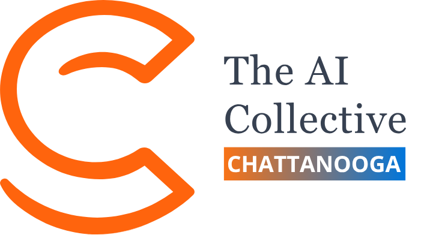
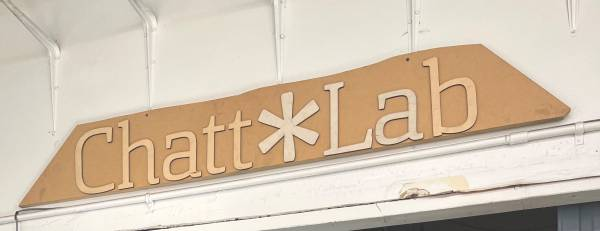
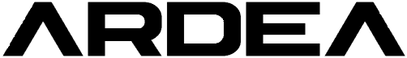
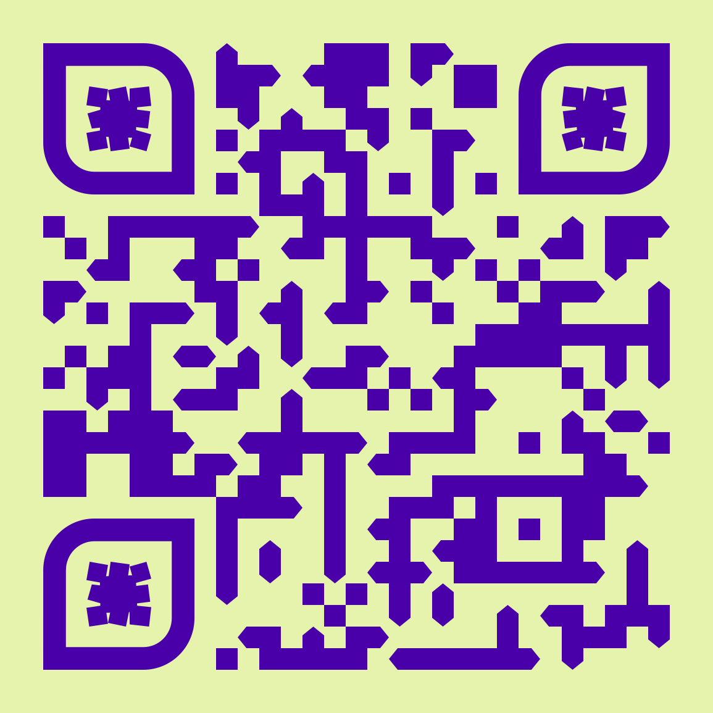

# AI Collective {.sponsor-slide background-color="#08080F"}

::: {.sponsor-row}
{.sponsor-logo width="320"}
:::

[This meetup is the **Chattanooga chapter of The AI Collective**, a community of practitioners exploring AI together.]{.body}

[[aicollective.com](https://www.aicollective.com/)]{.accent-cyan}

::: notes
Briefly: not a money sponsor, but they're the umbrella that made this meetup
exist. Point at the URL.
:::

# Chatt\*Lab {.sponsor-slide background-color="#08080F"}

::: {.sponsor-row}
{.sponsor-logo width="320"}
:::

[Chatt\*Lab is the maker space that's letting us use this room. My membership here unlocked it.]{.body}

[Want a tour afterwards? Grab me, **Cody**, or **Dan**.]{.accent-cyan}

[[wiki.chattlab.org](https://wiki.chattlab.org/)]{.muted}

::: notes
Mention the tour offer specifically. People who haven't been here always want
to see it.
:::

# Ardea {.sponsor-slide background-color="#08080F"}

::: {.sponsor-row}
{.sponsor-logo width="360"}
:::

[My research company. We work on **evolutionary systems** and **AI consciousness research**.]{.body}

[Today, also: the food sponsor.]{.accent-magenta}

[[ardea.io](https://ardea.io)]{.accent-cyan}

::: notes
Quick. Land the food joke. Mention the deep dive at 3:50 is Ardea's research.
:::

# Join the Discord {.center background-color="#08080F"}

::: {.center}
[{.qr-frame width="360"}]{.center}

[discord.gg/<TBD>]{.accent-cyan}

[Slides, repo, ongoing discussion.]{.muted}
:::

::: notes
Hold this slide for ~45 seconds. Phones up. Cue people that the repo and the
slides will live there after the talk. Replace the URL before going on stage.
:::

# {.title-slide background-color="#08080F"}

::: {.r-fit-text}
**Beyond the Chatbot**
:::

[A Tour of the AI Universe]{.accent-cyan}

[John Gardner ([Sinjhin](https://github.com/Sinjhin)) · Chattanooga AI Collective × Chatt\*Lab]{.muted}

[2026-05-23]{.faint}

::: notes
Cold open. Line out loud:

  "LLMs are everywhere right now, and for good reason. They create a lot of
   leverage. But they're one corner of a much bigger landscape, and some of
   the most consequential AI of the last decade wasn't language models at all."

Let it land. Then click to the agenda.
:::

# Agenda { #agenda }

[The shape of the afternoon ↓]{.muted}

1. Round table: Gen AI in production *(1:15)*
2. Yoga, probably.. *(2:00)*
3. The *other* game-changers *(2:05)*
4. Intermission *(2:45)*
5. Tour of paradigms beyond LLMs *(3:00)*
6. Attempted handstands (optional) *(3:45)*
7. Deep dive: hierarchical evolutionary systems *(3:50)*
8. Q&A *(4:30)*

::: notes
Don't dwell. The room knows it's a long afternoon. Mention that the slides
and repo are at the Discord QR from a couple slides back.
:::

# Round Table {.section-title background-color="#12132A"}

## Gen AI in production: what's actually adding value? {.smaller}

[1:15 to 2:00 · facilitator prompts]{.muted}

- Where did it land? (Workflow / product / internal tooling?)
- Where did you expect a win and not get one?
- The thing nobody warns you about
- One metric you watch

[Capture on the whiteboard. We'll come back to this.]{.accent-magenta}

::: notes
This is a facilitator slide, not a content slide. Read the prompts, then put
the slide remote down and run the discussion. Capture on the whiteboard;
don't try to type and listen.
:::

# Yoga {.break-card background-color="#12132A"}

[5-minute reset. Probably..]{.muted}

::: notes
Genuinely take the 5 minutes if the room is up for it. Stretch breaks reset
attention better than any deck transition.
:::

# The *Other* Game-Changers {.section-title background-color="#12132A"}

[2:05 to 2:45 · four systems that aren't LLMs]{.muted}

::: notes
Frame the section: "Each of these is a totally different stack. Different
math, different shape, different training. By the end I want you to feel the
*variety* under the AI umbrella, not just the LLM corner."
:::

# AlphaGo {.smaller}

> **The image.** A chess player who plays themselves a million times overnight,
> and wakes up smarter than they were.

[2016: beat the world's best Go player a decade before anyone expected.]{.muted}

[**Recipe:** Monte Carlo Tree Search + a policy network (which moves to consider) + a value network (who's winning) + self-play (the engine is its own training partner).]{.body}

[The pattern of *search guided by a learned heuristic* keeps showing up. Modern LLM "thinking" modes are quietly running cousins of this loop.]{.accent-magenta}

[more detail & further reading in the slide below ↓]{.detail-hint}

::: notes
Sell the image first. "Wakes up smarter than they were" does most of the work.
Then walk the recipe. AlphaZero generalized this; MuZero learned the rules
from scratch. The bridge slide later picks this back up.
:::

## AlphaGo: detail {.smaller .detail-slide}

**How it works**

- **Monte Carlo Tree Search.** Imagine playing out a position a thousand times in your head, randomly, and keeping score for which opening moves led to wins.
- **Policy network.** Narrows the imagined moves to the ones a strong player would consider, so the search doesn't waste time on nonsense.
- **Value network.** Guesses who's winning from a position, without playing out the rest of the game.
- **Self-play.** The engine plays itself for millions of games; each iteration is a slightly stronger opponent.

**Why it matters**

- Go was the canonical "computers can't do this" game. Too intuitive for brute force, too combinatorial for the alpha-beta search that worked for chess.
- AlphaGo's recipe (search + learned policy/value + self-play) generalizes well: AlphaZero (chess and shogi), MuZero (learned the rules of any board game from scratch), and the same pattern now shows up inside reasoning LLMs.

**Further reading**

- Silver et al., *Mastering the game of Go with deep neural networks and tree search.* [Nature 2016](https://www.nature.com/articles/nature16961)
- Silver et al., *Mastering Chess and Shogi by Self-Play* (AlphaZero). [arXiv:1712.01815](https://arxiv.org/abs/1712.01815)
- Schrittwieser et al., *Mastering Atari, Go, chess and shogi by planning with a learned model* (MuZero). [Nature 2020](https://www.nature.com/articles/s41586-020-03051-4)
- DeepMind, *AlphaGo* (2017 documentary).

# AlphaFold {.smaller}

> **The image.** Origami, but the paper is a sentence of amino acids and the
> final shape decides whether the protein heals you or kills you.

[2020: cracked a 50-year-old grand challenge in biology. 2024 Nobel Prize in Chemistry.]{.muted}

[**Recipe:** a transformer that reasons about which amino-acid positions are talking to each other, plus a *geometry-aware* network that respects rotations and translations. Output: atom coordinates accurate enough for drug discovery.]{.body}

[The architecture is **transformers + GNN + geometric deep learning** stacked. Not just one trick.]{.accent-magenta}

[more detail & further reading in the slide below ↓]{.detail-hint}

::: notes
Audience may not know what a protein actually does. Ground them: "everything
in your body is proteins folding into shapes, and the shape *is* the function."
:::

## AlphaFold: detail {.smaller .detail-slide}

**How it works**

- **Input.** An amino-acid sequence, plus a search through evolutionarily-related proteins (Multiple Sequence Alignment, "MSA"). Evolution leaves fingerprints of which positions co-vary, which hints at which atoms are physically close in the folded structure.
- **Evoformer.** A transformer variant that updates the sequence representation and a pairwise "this position talks to that one" matrix in lock-step.
- **Structure module.** A geometry-aware (equivariant) network that respects rotations and translations: turn the molecule, the prediction turns the same way. This is the load-bearing trick.
- **Output.** 3D atom coordinates plus a per-residue confidence score (pLDDT).

**Why it matters**

- Structures for nearly every known protein, free online at the [AlphaFold DB](https://alphafold.ebi.ac.uk/).
- Drug discovery, enzyme engineering, materials science, all on faster timelines.
- 2024 Nobel Prize in Chemistry.
- Architecturally, it's one of the cleanest demonstrations that *combining paradigms* (transformers + GNN + geometry) beats any single one.

**Further reading**

- Jumper et al., *Highly accurate protein structure prediction with AlphaFold.* [Nature 2021](https://www.nature.com/articles/s41586-021-03819-2)
- AlphaFold Protein Structure Database. [alphafold.ebi.ac.uk](https://alphafold.ebi.ac.uk/)
- DeepMind, *AlphaFold 3.* [blog](https://deepmind.google/discover/blog/alphafold-3-predicts-the-structure-and-interactions-of-all-of-lifes-molecules/)
- Mohammed AlQuraishi, *AlphaFold at CASP13* (accessible deep-dive).

# Stable Diffusion {.smaller}

> **The image.** Start with TV static. Squint at it until you see a cat. Squint
> harder, and the cat sharpens. The model is the trained squint.

[2022: image generation went from "research toy" to a phone app.]{.muted}

[**Recipe:** train a network to undo *one step* of noise. To generate, start from pure static and run the network many times, conditioned on a text prompt at each step.]{.body}

[Generation is **denoising**, not prediction. A different paradigm wearing a familiar product.]{.accent-magenta}

[more detail & further reading in the slide below ↓]{.detail-hint}

::: notes
This is the moment the audience leans in. They've all used these tools but
nobody told them what's happening under the hood. Tee up energy-based models
in the next section.
:::

## Stable Diffusion: detail {.smaller .detail-slide}

**How it works**

- **Forward process.** Take a real image. Add a tiny bit of Gaussian noise, then a tiny bit more, then more, for many steps. After enough steps it's indistinguishable from random static.
- **Reverse process.** Train a U-Net to predict what was added at each step, so it can undo one step at a time.
- **At generation.** Start from random static and run the trained network many times, conditioned on text embeddings at each step. The image gradually emerges.
- **Latent diffusion** (Stable Diffusion's specific trick): do all of the above in a compressed latent space instead of raw pixels, so it runs on a consumer GPU.

**Why it matters**

- First paradigm shift in generative modeling since GANs, and a much more stable training recipe.
- Generalized fast: video (Sora, Veo), audio, 3D shapes, protein backbones (RFdiffusion), molecules.
- The underlying math is **stochastic differential equations** and score matching, not next-token prediction. LLMs are not the only frontier; energy-based generation is its own arc.

**Further reading**

- Ho et al., *Denoising Diffusion Probabilistic Models* (DDPM). [arXiv:2006.11239](https://arxiv.org/abs/2006.11239)
- Rombach et al., *High-Resolution Image Synthesis with Latent Diffusion Models* (Stable Diffusion). [arXiv:2112.10752](https://arxiv.org/abs/2112.10752)
- Yang Song, *Generative Modeling by Estimating Gradients of the Data Distribution* (score-based, accessible). [blog](https://yang-song.net/blog/2021/score/)
- Lilian Weng, *What are Diffusion Models?* [blog](https://lilianweng.github.io/posts/2021-07-11-diffusion-models/)

# AlphaProof / AlphaGeometry {.smaller}

> **The image.** Pair-programming with a mathematician: one half guesses, the
> other half proves. Guess fast, check slow.

[2024: silver-medal level on the International Math Olympiad.]{.muted}

[**Recipe:** a neural network proposes candidate proof steps; a formal verifier (Lean, or a custom geometry engine) accepts or rejects each one. The neural side learns from the verdicts.]{.body}

[Pattern-matching **plus** provable correctness. Neither alone is enough.]{.accent-magenta}

[more detail & further reading in the slide below ↓]{.detail-hint}

::: notes
The concrete neurosymbolic story. Pair-programming image lands because most
of the room has done it. Tee up neurosymbolic AI in the next section.
:::

## AlphaProof / AlphaGeometry: detail {.smaller .detail-slide}

**How it works**

- **Neural side.** A language model trained on millions of proof attempts. It proposes candidate next-steps: fast, creative, often wrong.
- **Symbolic side.** A formal verifier. For algebra and number theory: Lean, a theorem prover where every accepted step is mechanically checked. For geometry: a custom symbolic engine that closes deductions over a fixed set of geometric axioms.
- **The loop.** Neural proposes, symbolic accepts or rejects, neural retrains on the accepted-rejected verdicts. Over many iterations the neural side learns which kinds of guesses tend to verify.

**Why it matters**

- Olympiad problems are where you cannot bluff. The answer has to be provable, not just plausible.
- First serious demonstration of **neurosymbolic AI at frontier capability**.
- A different shape of "intelligent": search guided by formal proof, not just next-token guess.
- Maps cleanly onto domains that need both pattern recognition and verifiable correctness: program synthesis, autonomy, law, medicine.

**Further reading**

- DeepMind, *AI achieves silver-medal standard solving International Mathematical Olympiad problems.* [blog](https://deepmind.google/discover/blog/ai-solves-imo-problems-at-silver-medal-level/)
- Trinh et al., *Solving olympiad geometry without human demonstrations* (AlphaGeometry). [Nature 2024](https://www.nature.com/articles/s41586-023-06747-5)
- Lean theorem prover. [leanprover.github.io](https://leanprover.github.io/)
- Terence Tao's [first-impressions post](https://terrytao.wordpress.com/) on the IMO result.

# Stacks, not tricks {.smaller}

Every system we just walked through is **multiple paradigms stacked**:

- AlphaGo = MCTS + deep RL + self-play
- AlphaFold = transformers + GNN + geometric deep learning
- Stable Diffusion = score-based / diffusion + U-Net + text conditioning
- AlphaProof = neural search + symbolic verifier

[So: let's look at the paradigms themselves.]{.accent-magenta}

::: notes
This is the bridge. Hold it for a beat. The audience now has the *motivation*
to care about Section 2: they've seen these paradigms in action.
:::

# Intermission {.break-card background-color="#12132A"}

[15 minutes. Coffee. Bathrooms.]{.muted}

::: notes
Don't skip. People need it, and you need it.
:::

# Paradigms Beyond LLMs {.section-title background-color="#12132A"}

[3:00 to 3:45 · three families plus honorable mentions]{.muted}

# Evolutionary methods {.smaller}

> **The image.** Throw a thousand random solutions at the wall. Keep the ones
> that stick. Mash them together. Repeat for a few thousand generations.
> Survival pressure does the rest.

[No gradients. No backprop. Just selection.]{.muted}

[**Recipe:** maintain a population of candidates, score each by a fitness function, then apply selection, mutation, and recombination to produce the next generation. Variants: **GA** (bits), **ES / CMA-ES** (continuous), **NEAT** (evolves network topology), **GP** (evolves programs), **swarm** (collective behavior).]{.body}

[Embarrassingly parallel. Works on black-box, discrete, non-differentiable problems where SGD can't go.]{.accent-magenta}

[more detail & further reading in the slide below ↓]{.detail-hint}

## Evolutionary methods: detail {.smaller .detail-slide}

**The variants, in plain language**

- **Genetic Algorithms (GA).** Bit-string genomes, classic mutation and crossover. The historical starting point.
- **Evolution Strategies (ES).** Continuous parameter vectors with self-adaptive step sizes. Surprisingly competitive with deep RL on hard control problems (OpenAI's 2017 paper).
- **CMA-ES.** Adapts the *covariance* of the mutation distribution to the local landscape shape. The gold standard for black-box continuous optimization.
- **NEAT.** Evolves both weights *and* network topology, growing complexity gradually.
- **Genetic Programming (GP).** The genome is an executable program (often an expression tree). Used in symbolic regression: recover the equation from the data.
- **Swarm intelligence** (PSO, ACO). Each agent shares simple local information; global behavior emerges from the swarm.

**Why it matters**

- Architecture and hyperparameter search.
- Robotics controllers when reward is sparse and gradients lie.
- Antenna design, circuit design, scheduling. Anywhere you can *recognize* a good answer but can't write its derivative.
- The substrate for the deep dive coming up at 3:50.

**Further reading**

- Salimans et al., *Evolution Strategies as a Scalable Alternative to Reinforcement Learning.* [arXiv:1703.03864](https://arxiv.org/abs/1703.03864)
- Hansen, *The CMA Evolution Strategy: A Tutorial.* [arXiv:1604.00772](https://arxiv.org/abs/1604.00772)
- Stanley & Miikkulainen, *NEAT.* [original paper](https://nn.cs.utexas.edu/?stanley:ec02)
- Koza, *Genetic Programming* (book). The canonical reference.

# Energy-based models {.smaller}

> **The image.** A landscape of hills and valleys. Drop a marble anywhere. It
> rolls downhill. The valleys are the things the model thinks are *real*.

[Train the landscape; let physics handle generation.]{.muted}

[**Recipe:** define an energy function over configurations. Training lowers the energy of real data and raises it for everything else. Generation rolls downhill from a random start. **Diffusion models** are a special case: they learn the local slope of the landscape (the *score*).]{.body}

[Hopfield networks (associative memory) won the **2024 Nobel Prize in Physics**.]{.accent-amber}

[more detail & further reading in the slide below ↓]{.detail-hint}

::: notes
The connective tissue: Stable Diffusion from Section 1 *is* an energy-based
model in disguise. Hopfield is the historical anchor. Score-based and modern
diffusion are the flagship.
:::

## Energy-based models: detail {.smaller .detail-slide}

**How it works**

- **The energy function.** A scalar `E(x)` defined over configurations. Configurations the model thinks are "right" sit in low-energy valleys.
- **Training.** Lower `E(x)` for real data; raise it everywhere else. Different methods (contrastive divergence, score matching, denoising) attack this at different angles.
- **Generation.** Start from a random configuration and follow the gradient downhill (Langevin dynamics, MCMC). End up in one of the valleys.
- **The diffusion connection.** Diffusion models *implicitly* learn the gradient of the log-probability (the "score"). Same math, friendlier training objective.

**Why it matters**

- The math is **physics**, not linguistics. Different intuitions, different limits.
- Generative modeling for images, video, audio, 3D shapes, protein backbones (RFdiffusion).
- Associative memory: store patterns, recall the original from a corrupted version. This is what won Hopfield the 2024 Physics Nobel.
- A different theory of *what it means for a model to know something*: not "predict the next token" but "be at low energy near plausible data".

**Further reading**

- LeCun, *A Tutorial on Energy-Based Learning.* [PDF](https://yann.lecun.com/exdb/publis/pdf/lecun-06.pdf)
- Hopfield, *Neural networks and physical systems with emergent collective computational abilities.* (1982; Nobel-cited)
- Song & Ermon, *Generative Modeling by Estimating Gradients of the Data Distribution.* [NeurIPS 2019](https://arxiv.org/abs/1907.05600)
- Hoogeboom et al., *Equivariant Diffusion for Molecule Generation.* [arXiv:2203.17003](https://arxiv.org/abs/2203.17003)

# Neurosymbolic AI {.smaller}

> **The image.** A musician who can also read sheet music. The ear catches
> what's there; the page catches what *has* to be there.

[Perception **plus** logic. Intuition **plus** proof.]{.muted}

[**Recipe:** combine neural front-ends (good at perception, fuzzy pattern-matching) with symbolic back-ends (good at logic, composition, provable correctness). Architectures vary: neural-then-symbolic pipelines, differentiable logic, program synthesis with neural priors, **LLM + formal verifier** (AlphaProof).]{.body}

[**Bet:** pure pattern-matching hits a ceiling, pure logic hits a ceiling, and the interesting space is between them.]{.accent-magenta}

[more detail & further reading in the slide below ↓]{.detail-hint}

## Neurosymbolic AI: detail {.smaller .detail-slide}

**Architectural patterns**

- **Neural-then-symbolic pipeline.** A neural network perceives, then hands a structured representation to a classical reasoner (planner, theorem prover, knowledge graph).
- **Differentiable logic.** Embed logical operators into the neural network so the whole thing trains end-to-end with gradient descent. Examples: Logic Tensor Networks, DeepProbLog.
- **Program synthesis with neural priors.** A neural model proposes programs; an interpreter checks if they work.
- **LLM + formal verifier.** A language model proposes proof or code steps; a formal system (Lean, Coq, type-checker) acts as the ground truth. AlphaProof is the headline example.

**Why it matters**

- Theorem proving (AlphaProof, LeanDojo).
- Program synthesis.
- Scientific discovery.
- Anywhere you need **both** perception and verifiable correctness: autonomy, law, medicine, math.
- A serious candidate for what "intelligence past raw scaling" looks like. Symbol grounding from the neural side, generalization from the symbolic side.

**Further reading**

- Garcez & Lamb, *Neurosymbolic AI: The 3rd Wave.* [arXiv:2012.05876](https://arxiv.org/abs/2012.05876)
- Kautz, *The Third AI Summer.* [AAAI talk](https://henrykautz.com/talks/)
- Mao et al., *The Neuro-Symbolic Concept Learner.* [ICLR 2019](https://arxiv.org/abs/1904.12584)
- LeanDojo. [leandojo.org](https://leandojo.org/)

# Honorable mentions {.smaller}

- **Gradient-boosted trees** (XGBoost, LightGBM). Still king of tabular data. [paper](https://arxiv.org/abs/1603.02754)
- **Probabilistic / Bayesian methods.** When calibrated uncertainty matters more than raw accuracy.
- **Geometric DL & GNNs.** AlphaFold, weather (GraphCast), materials.
- **State-space models** (Mamba, S4). Linear-time challenger to transformers. [Mamba](https://arxiv.org/abs/2312.00752)
- **Active inference / Free energy.** Perception and action as one optimization. Increasingly relevant to consciousness research.
- **Cellular automata / Neural CA.** Emergence from local rules. [growing NCA](https://distill.pub/2020/growing-ca/)
- **Spiking / neuromorphic.** Ultra-low-power biological-style nets on specialized hardware.

[Full citations in the repo's `references.bib`. Click through.]{.muted .footer}

# Attempted handstands (optional) {.break-card background-color="#12132A"}

[Strongly encouraged.]{.muted}

# Research Deep Dive {.section-title background-color="#12132A"}

[3:50 to 4:30 · hierarchical evolutionary systems with orchestration]{.muted}

# Why hierarchy, why evolution, why orchestration {.smaller}

- **Why evolution.** Gradients require a smooth, differentiable objective. Most interesting objectives aren't.
- **Why hierarchy.** Search at a single scale plateaus. Stack search inside search, and the plateau breaks.
- **Why orchestration at the top.** The upper layer's job isn't to *solve*. It's to *decide which layer below is solving the right problem*.

[Thesis: **stacked search, glued together by something that can reason about the stack itself.**]{.accent-magenta}

[more detail & further reading in the slide below ↓]{.detail-hint}

::: notes
Don't rush this. The motivation sells the rest. If the room is with you on
*why*, the architecture diagram on the next slide does the rest of the work.
:::

## Why this shape: detail {.smaller .detail-slide}

**The case for evolution at the substrate**

- Gradient descent needs a differentiable, smooth objective. Real-world tasks rarely are. Composability, novelty, "interestingness", credit assignment across long horizons: all places where gradients struggle.
- Evolution doesn't need a derivative. It needs a scoring function and a way to recombine. This works on discrete, non-differentiable, or black-box problems where SGD won't.

**The case for hierarchy**

- A single evolutionary loop converges, then plateaus. It can't redefine what fitness *means* on its own.
- A second loop *above* the first can: it evolves the configurations and objectives of the layer below. The plateau breaks because the system can now climb in fitness-space *and* in fitness-definition-space.
- This generalizes: each higher rung is search over the search-spaces of the rung below.

**The case for orchestration at the top**

- Pure stacked search lacks a notion of "what are we even trying to accomplish right now."
- The orchestrator is the part that reads the stack's behavior and *re-aims* it. In our prototype this is an LLM with tools, but the role is general: a controller that picks which sub-problem to prioritize next.
- The bet: this is structurally close to what active inference and predictive processing describe in biological minds.

# Architecture sketch {.smaller}

```{mermaid}
flowchart TB
  subgraph L0["L0 · Substrate"]
    P0["Population of solutions"]
    F0["Fitness eval"]
    P0 --> F0 --> P0
  end
  subgraph L1["L1 · Strategy"]
    P1["Population of L0 configurations"]
    F1["Meta-fitness"]
    P1 --> F1 --> P1
  end
  subgraph L2["L2 · Goal"]
    P2["Population of L1 objectives"]
    F2["Outer signal"]
    P2 --> F2 --> P2
  end
  ORCH(("Orchestrator")):::accent
  ORCH -. directs .-> L2
  ORCH -. directs .-> L1
  ORCH -. directs .-> L0
  L0 --> L1 --> L2 --> ORCH

  classDef accent fill:#9B5CFF,stroke:#FF4FCB,color:#08080F;
```

[Three rungs · an orchestrator that reads the stack and adjusts pressure.]{.muted}

::: notes
Walk the diagram bottom-up. Each rung is a full evolutionary loop. The
orchestrator is the load-bearing piece. It's what makes this an *AI system*
and not just nested optimization.
:::

# What's working, what's open {.smaller}

**Working**

- The substrate-level loop runs and converges on toy problems.
- The orchestrator-as-LLM-with-tools framing has been useful for prototyping the upper layer cheaply.
- Mapping the architecture onto consciousness research (self-models, predictive processing) is producing testable questions.

**Open**

- **Credit assignment across layers.** When the outer signal fires, which rung deserves the update?
- **Compute.** Naively, hierarchy multiplies population by generations. Need shortcuts.
- **Evaluation.** What does "working" mean for a system whose objective is generated by another part of itself?
- **Orchestrator stability.** The upper layer is the only non-evolutionary piece. Should it be?

[Honest: this is a research program, not a product. Yet.]{.muted}

[more detail & further reading in the slide below ↓]{.detail-hint}

## What's open: detail {.smaller .detail-slide}

**On credit assignment across layers**

- When the outer signal fires (say, the orchestrator marks a goal as "achieved"), the credit has to flow back through L2 to L1 to L0. Each layer's population needs to know *its* contribution.
- Candidate approaches: hindsight relabeling, lineage-tracked updates, novelty-based credit, multi-objective Pareto fronts.

**On compute**

- A naive implementation has the inner loop run for hundreds of generations before the outer loop gets a single evaluation. The compute multiplies fast.
- Tactics that help: shared substrate populations across L1 candidates, learned surrogate fitness, importance sampling, multi-fidelity evaluation.

**On evaluation**

- Standard ML evaluation assumes a fixed test set. This system *generates* its own evaluation criteria over time.
- Open-ended evolution literature (POET, Quality-Diversity) is the closest established work.

**On orchestrator stability**

- The orchestrator is currently the only non-evolutionary piece, so it's a fixed point the rest of the system reasons relative to.
- Open question: should it itself be evolved, or is some non-evolutionary structure load-bearing for the whole thing to be coherent?

# Touchpoints with consciousness research {.smaller}

- **Predictive processing.** Agents that minimize a single quantity (free energy) look a lot like a hierarchy with an orchestrator.
- **Active inference.** The Friston program. Mathematically demanding, philosophically ambitious, increasingly relevant.
- **Open-ended evolution.** Does the system keep generating *novel* fitness regimes, or does it converge?
- The honest version: we don't know what consciousness is, but we have hypotheses with empirical handles now.

[I work on this part-time at Ardea. Augs is the planned product wrapper.]{.accent-cyan}

[more detail & further reading in the slide below ↓]{.detail-hint}

## Consciousness research: detail {.smaller .detail-slide}

**Predictive processing**

- The brain (and any sufficiently-rich agent) is constantly making predictions about its sensory inputs and updating its world-model on prediction errors.
- This frames perception, action, learning, and even attention as the same operation: minimize surprise (a.k.a. variational free energy).
- The architectural shape is hierarchical: low-level predictions feed up, high-level corrections feed down.

**Active inference**

- Karl Friston's program, building on predictive processing.
- An agent acts to make its sensory inputs match its predictions, which under the right priors looks like curiosity, planning, and homeostasis (all in one math).
- Increasingly relevant to consciousness research because it gives a single optimization principle that can ground subjective experience.

**Open-ended evolution**

- Most evolutionary systems converge. Open-ended systems keep generating new fitness regimes indefinitely (POET, Quality-Diversity).
- Relevant because consciousness, whatever else it is, doesn't seem to settle. It keeps generating new problems for itself.

**Further reading lives on the next slide.**

# Discussion prompts {.smaller}

1. Should the orchestrator itself be evolved, or is some non-evolutionary structure load-bearing?
2. Is hierarchy enough, or do we need **lateral** structure too (peer layers, not just stacked)?
3. Where does **active inference** belong in this picture: a fourth layer, or the *binding agent* across layers?
4. The honest one: how do we tell if this is **actually intelligent** vs. cleverly-engineered hill-climbing?

[more detail & further reading in the slide below ↓]{.detail-hint}

::: notes
Read them all up front, then pick whichever the room reacts to most. Prompt 4
is the one that usually surfaces the most interesting pushback.
:::

## Deep dive: further reading {.smaller .detail-slide}

- Friston, *The free-energy principle: a unified brain theory?* [Nature Reviews Neuroscience 2010](https://www.fil.ion.ucl.ac.uk/~karl/The%20free-energy%20principle%20A%20unified%20brain%20theory.pdf)
- Wang et al., *POET: Paired Open-Ended Trailblazer.* [arXiv:1901.01753](https://arxiv.org/abs/1901.01753)
- Lehman & Stanley, *Abandoning Objectives: Evolution Through the Search for Novelty Alone.* [paper](https://www.cs.swarthmore.edu/~meeden/DevelopmentalRobotics/lehman_ecj11.pdf)
- Quality-Diversity overview. [quality-diversity.github.io](https://quality-diversity.github.io/)
- Ardea (research notes). [ardea.io](https://ardea.io)

# Thanks · Q&A {.smaller}

- This deck + repo: [github.com/Sinjhin/20260523-Beyond_The_Chatbot](https://github.com/Sinjhin/20260523-Beyond_The_Chatbot)
- Discord: [discord.gg/<TBD>]{.accent-cyan}
- Find me: John Gardner · [Sinjhin](https://github.com/Sinjhin) on GitHub · [Ardea](https://ardea.io)

::: {.center}
[Stick around. Ask the awkward questions.]{.accent-magenta}
:::

::: notes
Take questions for 20 to 25 min, then ease into mingling. The deep-dive
prompts tend to draw the most Q&A; fall back to them if the room is quiet.
:::
